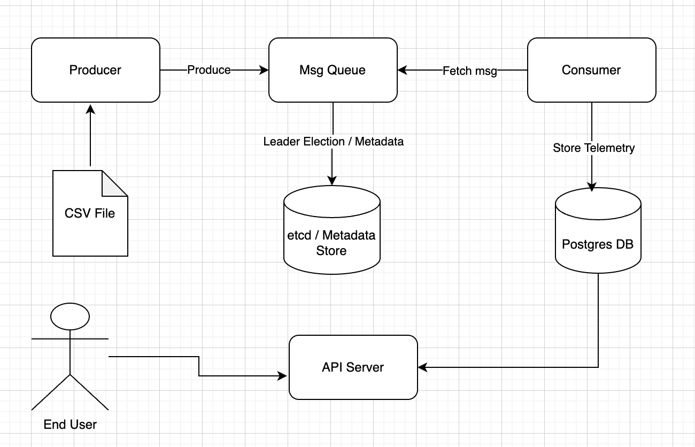

**Telemetry Pipeline**

**Overview**

Telemetry Pipeline is a distributed system for collecting, transporting, and storing GPU telemetry metrics.
It mimics a Kafka-like message queue with producers, consumers, and an internal replication model.
Metrics flow from producer → message queue → consumer → PostgreSQL/TimescaleDB, with an API server for queries.

**Architecture:**




**Components:**

**Producer:**
- Periodically Reads telemetry data from csv file
- Batches the records/messages 
- Pushe/Produce telemetry batches to Message Queue

**Message Queue:**
    The Message Queue is the heart of the telemetry pipeline.
    It is inspired by Kafka and implements a distributed log with replication, leader election, and offset tracking.

**Design**
* Partitioned Log
    - Each topic is split into partitions, which are append-only logs.
    - A partition is ordered, durable, and persisted to disk via segment files + indexes.
    - Offsets are monotonically increasing and uniquely identify each message.

* Leaders and Followers
    - Each partition has a leader broker that accepts writes from producers.
    - Followers replicate data from the leader to ensure durability and fault tolerance.
    - If a leader fails, a new leader is elected from the in-sync replicas (ISR) using etcd.

* High Watermark
    - Tracks the highest offset that is fully replicated to all ISR nodes.
    - Consumers only read messages up to the high watermark, ensuring they only see committed data.

* Replication Protocol
    - Implemented with a Replicator gRPC service.
    - Followers fetch batches from leaders and append to their local logs.
    - Keeps replicas strongly consistent with leaders.

* Metadata Management
    - etcd stores:
        * Broker registrations (brokerID → host:port)
        * Topic → Partition → Leader/ISR mapping
    - The Metadata RPC allows clients to discover the leader for any topic/partition dynamically.

* Durability and Recovery
    - Messages are fsynced and indexed to disk.
    - On startup, segment/index pairs are validated and corrupted entries truncated.
    - Ensures no data loss even after crashes.

**Features**
- Append-only Log Storage
    * Efficient disk writes with sequential appends and segment rolling.
- Leader-based Replication
    * Guarantees at-least-once delivery with in-sync replicas.
- Offset Management
    * Consumers track offsets (committed to DB) for exactly-once or at-least-once semantics.
- High Throughput
    * Batching (both on producer & consumer side) reduces RPC and DB overhead.
- Fault Tolerance
    * Brokers register in etcd with leases (heartbeats).
    * Failures automatically trigger leader re-election.
    * Surviving replicas continue serving.
- Horizontal Scalability
    * Topics can be partitioned across brokers, distributing load.

**Advantages**
- Durability: Messages are never lost once acknowledged by the leader.
- Scalability: Can scale producers, consumers, and brokers independently.
- Decoupling: Producers and consumers don’t need to know about each other.
- Replayability: Consumers can reprocess messages from any offset.
- Back-pressure handling: Queue can buffer spikes in producer traffic.
- Efficient storage: Log segments and indexes allow constant-time seek + sequential reads/writes.
- Kubernetes-native: Brokers run as statefulsets with etcd for coordination.

**Produce Flow (Writing Messages)**
    
The Produce RPC lets a producer send one or more messages to the cluster.

Steps:
1. Producer → Metadata Lookup
    * Producer first calls Metadata RPC to discover which broker is leader for the target topic/partition.
    * It caches this leader mapping (topic → partition → leaderAddr).

2. Produce RPC → Leader Broker
    * Producer sends a ProduceRequest directly to the leader broker:
        * topic
        * partition (or -1 for auto-hash/round-robin)
        * batch of messages
        * acks (NONE, LEADER, ALL)

3. Leader Append to Log
    * Leader appends the batch of messages to its local partition log (disk segment).
    * Each message is assigned a monotonically increasing offset.
    * The log is flushed (fsync or buffered depending on config).

4. Replication (if acks=ALL)
    * Leader forwards the new batch to all followers in the ISR (in-sync replicas) via Replicator.Append.
    * Followers append to their local logs and acknowledge.

5. High Watermark Update
    * Once all ISR have written up to offset N, the leader advances the high watermark to N.

6. Acknowledge Producer
    * Leader responds to producer with the assigned offsets.
    * Depending on acks:
        NONE: return immediately after local append.
        LEADER: wait for leader fsync.
        ALL: wait until ISR replication completes.

Guarantees:
- At-least-once delivery when acks=LEADER or ALL.
- Durability: Message is safe once acked.
- Ordering: Messages in a partition are always delivered in the same order they were produced.

**Fetch Flow (Reading Messages)**

The Fetch RPC lets consumers read committed messages from a partition.

Steps:
1. Consumer → Metadata Lookup
    * Consumer calls Metadata RPC to find the leader for a partition.

2. Fetch RPC → Leader Broker
    * Consumer sends a FetchRequest with:
        - topic
        - partition
        - starting offset
        - max_messages, max_bytes, wait_ms (for batching / long polling).

3. Leader Serves from Log
    * Leader reads from its partition log segments starting at offset.
    * Only returns messages ≤ high watermark (ensures committed messages only).
    * Collects up to max_messages or max_bytes.

4. Response to Consumer
    * Leader returns FetchResponse:
        - records: list of messages with their offsets.
        - high_watermark: so consumer knows progress.
    * Consumer updates its internal offset pointer.

5. Offset Commit (optional)
    * Consumer can commit offsets using CommitOffsets RPC.
    * Offsets may be stored in MQ metadata or external DB.
    * On restart, consumer resumes from last committed offset.

Guarantees:
- Consumers see messages in-order per partition.
- Consumers never see uncommitted data (only up to high watermark).
- Supports replay (by resetting offset to earlier value).
- Supports parallelism (partitions can be consumed independently).

Example Timeline
* Producer writes [M1, M2, M3] to partition-0.
* Leader assigns offsets [0,1,2], replicates to followers.
* High watermark = 2 after ISR ack.
* Consumer with offset=0 fetches → receives [M1,M2,M3].
* Consumer commits offset=3 (next to read).

**Consumer:**
- Fetches messages from message queue via FetchRequest - topic, partition, offset, max_msgs
- Process/Enrich the GPU telemetry
- Uses Bulk insertion method to efficiently handle more load/TPS and updates the successfully processed offset value to consumer_offsets table
- If consumer restarts, read the offset value from consumer_offsets table and starts fetch from that offset to ensure no duplicate record in DB

**API Server:**
- Exposes REST Endpoints on port 8080
- Proper input validation (Enum-based validation)
- Pagination support (handle large response) was implemented for all APIs.
- Generates swaager/OpenAPI Spec and Exposes Swagger Documentation (/swagger/index.html)

*API Endpoints:*
1. List GPUs - GET /api/v1/gpus?limit=10&offset=0
    * returns list of GPU seen in telemetry with uuid (device + hostname)

2. GPU Metrics - GET /api/v1/gpus/{gpu_id}/metrics
    * Query Param: 
        - start_time, end_time: Time window filtering
        - Metric_name: Enum (DCGM_FI_DEV_DEC_UTIL, DCGM_FI_DEV_ENC_UTIL, DCGM_FI_DEV_FB_FREE .....)
        - aggregation: Enum (min, max, avg, sum)
        - Pagination (limit, offset)
    * Returns the aggregate metric for the given GPU

3. Fetch GPU Telemetry - GET /api/v1/gpus/{gpu_id}/telemetry
    * Returns time-series telemetry data for a given GPU

4. OpenAPI Spec:
    * make openapi -> auto generate openapi spec for the api
    * Exposed at /swagger/index.html


**Helm chart:**

    - K8s friendly, Comes with Helm chart and health checks
    - easy to install (umbrella chart model)
    - easy to upgrade version
    - easy configuartion support for dev and prod environment
    - Horizontal scalablility support with replicas


**Testing:**
```
cd chart
helm dependency update telemetry-platform
helm upgrade --install tp chart/telemetry-platform -n telemetry --create-namespace

# Create Topic
% grpcurl -plaintext -d '{"topic":"events","partitions":3,"rf":3}' \
  127.0.0.1:9092 mq.MQ/CreateTopic

# copy CSV file to producer pod (unable to create configmap, due to max size issue 1MB)
% kubectl cp data/dcgm_metrics_20250718_134233.csv <producer pod>:/data/input.csv -n telemetry
```

**Cleanup:**

    helm uninstall tp -n telemetry

**For local testing:**
    Run Postgres DB locally
    ```
        docker run --name pg -e POSTGRES_PASSWORD=pass -e POSTGRES_USER=user -e POSTGRES_DB=telemetry -p 5432:5432 -d postgres:15
    ```
To connect K8s postgres DB

PostgreSQL can be accessed via port 5432 on the following DNS names from within your cluster:

    tp-postgresql.telemetry.svc.cluster.local - Read/Write connection

To get the password for "postgres" run:

    export POSTGRES_ADMIN_PASSWORD=$(kubectl get secret --namespace telemetry tp-postgresql -o jsonpath="{.data.postgres-password}" | base64 -d)

To get the password for "telemetry" run:

    export POSTGRES_PASSWORD=$(kubectl get secret --namespace telemetry tp-postgresql -o jsonpath="{.data.password}" | base64 -d)

To connect to your database run the following command:

    kubectl run tp-postgresql-client --rm --tty -i --restart='Never' --namespace telemetry --image docker.io/bitnami/postgresql:17.6.0-debian-12-r0 --env="PGPASSWORD=$POSTGRES_PASSWORD" \
      --command -- psql --host tp-postgresql -U telemetry -d telemetry -p 5432

    > NOTE: If you access the container using bash, make sure that you execute "/opt/bitnami/scripts/postgresql/entrypoint.sh /bin/bash" in order to avoid the error "psql: local user with ID 1001} does not exist"

To connect to your database from outside the cluster execute the following commands:

    kubectl port-forward --namespace telemetry svc/tp-postgresql 5432:5432 &
    PGPASSWORD="$POSTGRES_PASSWORD" psql --host 127.0.0.1 -U telemetry -d telemetry -p 5432

WARNING: The configured password will be ignored on new installation in case when previous PostgreSQL release was deleted through the helm command. In that case, old PVC will have an old password, and setting it through helm won't take effect. Deleting persistent volumes (PVs) will solve the issue.

WARNING: There are "resources" sections in the chart not set. Using "resourcesPreset" is not recommended for production. For production installations, please set the following values according to your workload needs:
  - primary.resources
  - readReplicas.resources
+info https://kubernetes.io/docs/concepts/configuration/manage-resources-containers/


*To run etcd locally*

    etcd --listen-client-urls=http://127.0.0.1:2379 \
        --advertise-client-urls=http://127.0.0.1:2379